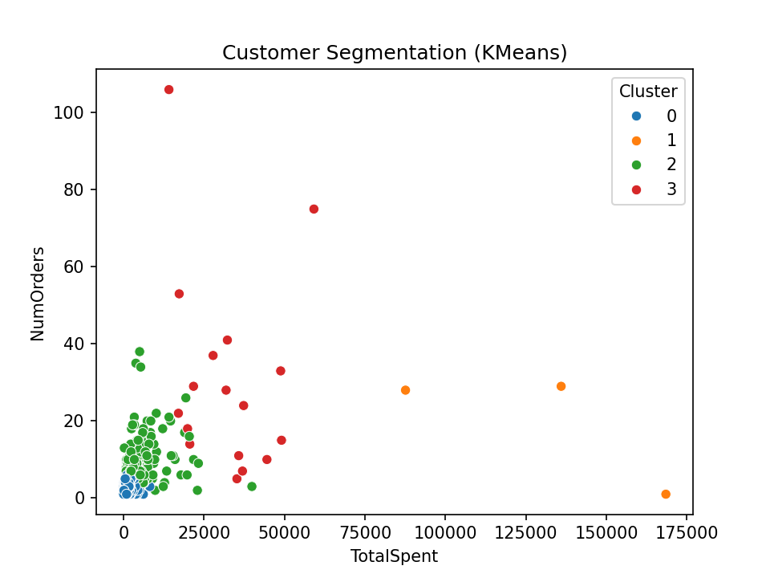
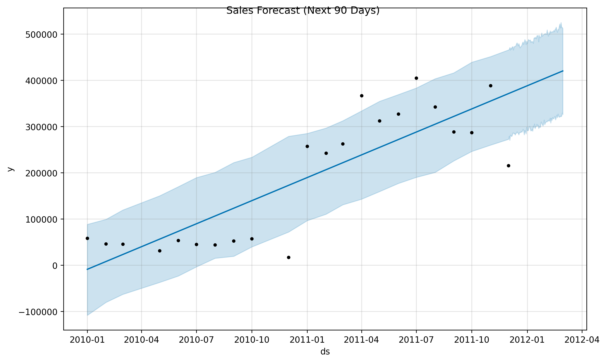

#  Marketing Analytics Using AI & Machine Learning

    Project Overview

This project applies Artificial Intelligence (AI) and Machine Learning techniques to analyze customer behavior and forecast future sales using the Online Retail dataset.

The analysis combines customer segmentation, sales forecasting, and marketing strategy recommendations to demonstrate how data-driven insights can support business decision-making and improve marketing effectiveness.


    Dataset

**Online Retail Dataset (Kaggle)**

The dataset contains transactional records from a UK-based online retailer, including customer purchases, product information, sales values, and transaction dates.


    Key Visualizations

### Customer Segmentation (K-Means Clustering)



### Sales Forecast (Next 90 Days)



### Monthly Sales Trend


---

   Project Workflow

### Exploratory Data Analysis (EDA)

* Cleaned and prepared transactional data.
* Removed cancelled transactions and handled missing values.
* Analyzed sales trends, product performance, and geographic sales distribution.
* Created the `TotalPrice` feature for revenue analysis.

### Customer Segmentation

* Performed RFM (Recency, Frequency, Monetary) analysis.
* Applied K-Means clustering to identify customer groups.
* Classified customers into:

  * Standard Customers
  * Inactive Customers
  * Loyal Customers
  * Super VIP Customers

### Sales Forecasting

* Aggregated historical sales data.
* Built a Prophet forecasting model.
* Generated a 90-day sales forecast.
* Visualized future sales trends and confidence intervals.

### Marketing Recommendations

* Applied insights to the 7Ps Marketing Mix framework:

  * Product
  * Price
  * Place
  * Promotion
  * People
  * Process
  * Physical Evidence

---

     Key Findings

* Identified four distinct customer segments using RFM analysis and K-Means clustering.
* Super VIP customers represented a very small portion of customers but generated the highest spending.
* Inactive customers were identified as a key target for re-engagement campaigns.
* Sales analysis revealed clear seasonal purchasing patterns.
* Prophet forecasting provided actionable insights for demand planning and inventory management.
* Customer insights were translated into targeted marketing recommendations using the 7Ps framework.

---

     Tools & Technologies

* Python
* Pandas
* NumPy
* Matplotlib
* Seaborn
* Scikit-Learn
* Prophet
* Jupyter Notebook

---
     Project Structure

```text
Marketing-Analytics-AI/
│
├── data/
├── notebooks/
├── visuals/
├── report/
│   └── Marketing_Analytics_AI_ML_Report.pdf
├── README.md
└── requirements.txt
```

---

## Full Report

📄 [View Full Project Report](reports/Marketing_Analysis_Report.pdf)

---

      Author

**Marie Essis**
MBA in Data Analytics
